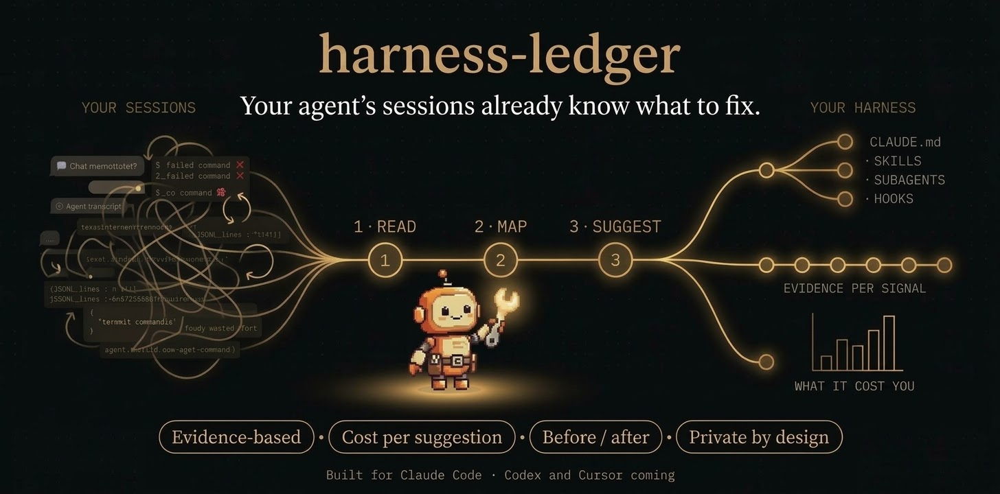

<h1 align="center">harness-ledger</h1>

<p align="center">
  <strong>Every piece of your coding agent's harness, with what it costs you and the receipts.</strong>
  <br />
  <em>Reads the sessions your agent already saves, names the piece behind each problem, and checks whether the fix worked. Built for Claude Code; Codex and Cursor are next.</em>
</p>

<p align="center">
  <a href="#quick-start"></a>
  <a href="https://github.com/guilhermebkel/harness-ledger/releases/latest"></a>
  <a href="https://github.com/guilhermebkel/harness-ledger/actions/workflows/ci.yml"></a>
  <a href="LICENSE"></a>
  <a href="https://code.claude.com/docs/en/plugins"></a>
  
</p>

<p align="center">
  
</p>

---

**You added a skill because it seemed useful. You gave a subagent a stronger model "just in case". Your CLAUDE.md grows every time something goes wrong. Which of those changes actually helped?**

Your harness is everything around your coding agent: the instructions file, skills, subagents, commands, hooks, MCP servers and plugins. It decides how well the agent works, yet it is usually tuned by gut feeling.

`harness-ledger` reads the session transcripts your agent already saves on your machine, maps your current harness, and tells you **which piece is causing which problem, what it cost you in time and tokens, and what to change**, with the exact session and step behind every suggestion. Then it checks whether the change helped.

> **More text is rarely the fix.** When a rule is already written and the agent ignores it, the answer is a hook or a check, not a longer prompt. The plugin tells those cases apart.

---

## What you get

<table>
<tr>
<td width="50%" valign="top">

**Findings with evidence**

Every finding points to the session, the transcript line and the thread it came from. No evidence, no finding.

</td>
<td width="50%" valign="top">

**A cost on every suggestion**

Time, tokens and money per suggestion, counted by a local script, never estimated by the model. Two suggestions never share the same cost.

</td>
</tr>
<tr>
<td valign="top">

**The right kind of fix**

Each finding gets a class (rule ignored, instruction missing, structure change...) and the class decides the fix: enforce, rewrite, add, restructure or remove.

</td>
<td valign="top">

**Before and after**

Accept a suggestion and later runs compare the piece before and after the change, in errors, corrections, time and cost.

</td>
</tr>
</table>

## Quick start

### 1. Install the plugin

```text
/plugin marketplace add guilhermebkel/harness-ledger
/plugin install harness-ledger@guilhermebkel
```

Requires Node.js 20+. Nothing else is installed: the analysis script ships prebuilt.

### 2. Analyze your sessions

Open Claude Code in your project, pick your strongest reasoning model with `/model`, and run:

```text
/harness-ledger:audit-harness
```

It works on the sessions you already have, from the first run. No extra logging, no setup.

### 3. Keep going

```text
# Focus on one piece or period
/harness-ledger:audit-harness only the code-reviewer subagent, last 2 weeks

# Check whether a change helped
/harness-ledger:audit-harness did my change to code-reviewer help?

# Review what was suggested before
/harness-ledger:audit-harness show pending suggestions
```

Suggestions are never applied on their own. Applying one always asks first and only touches harness files.

## Example

<sub>Illustrative output.</sub>

```text
Analyzed 41 sessions (last 30 days) · 3 suggestions
What these problems already cost: failures ≥ 52 min · re-reads ~18 min · corrected turns ≤ 40 min
Claude Code itself reports $16.20 for these sessions; the script estimates ~$14.

#1  Enforce a rule that already exists                    subagent: test-runner
    Ran `npm test` 11 times in 6 of 41 sessions; the repo uses `pnpm test`,
    and CLAUDE.md line 3 already says so.
    Cost:  at least 38 min · 210k tokens · $1.90
           from each failed `npm test` until `pnpm test` ran, reasoning included
    Proof: session 3f2a… line 14 · session 91bc… line 7 · +4 more
    Fix:   a hook that rewrites `npm test` to `pnpm test` in this repo, not more text.
    Then:  compare test-runner after a few sessions to see if it stopped.

#2  Fix an instruction                                     subagent: code-reviewer
    Re-read 9 files the main session had just read, in 5 of 41 sessions.
    Cost:  about 12 min · 340k tokens · $1.10
    Fix:   pass the changed-files summary when delegating. [proposed text]

#3  Change the structure                                   repeated request
    "Generate the changelog entry from the last PRs", asked in 7 of 41 sessions.
    Cost:  about 25 min · 180k tokens · $0.95
    Fix:   turn it into a skill. [draft SKILL.md]
```

## What it finds

| Class | When | Suggested fix |
| --- | --- | --- |
| **Rule exists, but is ignored** | The instruction is there; the agent doesn't follow it | Enforce it: a script, hook or check |
| **Partial or outdated instruction** | It exists but is incomplete or contradicts the repo today | Fix the text in the right piece |
| **Missing instruction** | Nothing in the harness covers it | Add it where it belongs |
| **Structure change** | A pattern repeats across sessions | Turn it into a skill, subagent or script, or remove an unused piece |
| **Out of scope** | The problem is in a piece you don't control | Recommendation only |
| **Already handled** | Already suggested, rejected or changed | Listed, never repeated |

The signals behind them: failed commands and the fix loops around them, wrong commands that a different one fixed, repeated file reads, subagents re-reading what the main thread just read, corrections and rejected plans, permission denials, repeated requests, procedures done by hand again and again, files and outputs that keep filling the context, unused or oversized pieces, and API errors.

## How it works

```text
  your sessions ──▶ 1. READ ──▶ 2. MAP ──▶ 3. SUGGEST ──▶ 4. COMPARE
  (already saved)    local       your        classified     before vs after,
                     script      harness     and costed     once you change it
```

The work is split on purpose:

| Part | Does | Why |
| --- | --- | --- |
| **Local script** (`dist/harness-ledger.mjs`) | Parses transcripts, inventories the harness, extracts signals, counts time, tokens and cost, compares before and after | Numbers must be reproducible. The model never estimates one. |
| **Your agent**, running the skill | Groups signals by cause, tells real friction from ordinary work, classifies each finding and writes the change | That's judgment, and it's where a weaker model goes wrong. |

Run it on the most capable reasoning model you have. The script does the reading and counting, so the model only sees a compact summary; it's a recommendation, and the skill says so once if you're on a smaller model.

### How the numbers work

The numbers are why you'd trust a finding, so they come with their limits:

- **Each one says what kind of number it is:** *at least* (a lower bound), *at most* (an upper bound) or *about* (an estimate). Numbers of different kinds are never added together.
- **Each one says how often:** "11 times in 6 of 41 sessions", so one bad session doesn't pass for a habit.
- **They measure what was spent, not what you'll save.** A saving is only claimed after a before/after comparison shows it.
- **Your agent's own figure sits beside the estimate.** Claude Code records its cost per session; the report shows both and never sums them.
- **Thin evidence is marked partial,** with the reason, instead of being rounded up into a finding.

The full rules, signal by signal, are in [`docs/cost-model.md`](docs/cost-model.md).

<details>
<summary><b>Running the script yourself</b></summary>

The skill calls the bundled script, and you can too:

```bash
node dist/harness-ledger.mjs analyze --since 14d --pretty   # inventory, signals and per-piece usage
node dist/harness-ledger.mjs evidence <signal-id>            # every occurrence behind one signal
node dist/harness-ledger.mjs compare --piece agent:code-reviewer
node dist/harness-ledger.mjs --help
```

Everything it prints is JSON. It writes only to `.harness-ledger/` in your project.

To see what a run of the skill cost you, look at its own row the next time you analyze: `node dist/harness-ledger.mjs analyze --piece skill:harness-ledger:audit-harness`.

</details>

## Supported agents

| Agent | Status |
| --- | --- |
| Claude Code | ✅ Supported, as a plugin |
| Codex | 🔜 Planned ([#3](https://github.com/guilhermebkel/harness-ledger/issues/3)) |
| Cursor | 🔜 Planned ([#4](https://github.com/guilhermebkel/harness-ledger/issues/4)) |

Each agent is a provider: one folder that reads its own transcripts and settings into a shared model. Want yours? [`docs/adding-a-provider.md`](docs/adding-a-provider.md) walks through it.

## Privacy

- **Everything runs locally.** Transcripts are read in place, never copied, never sent. Only derived, redacted findings are stored, in `.harness-ledger/`.
- **Secrets stay out.** Every string that can reach a report goes through redaction. Hooks and MCP servers are kept as names and shapes, never their commands, arguments or env values.
- **No telemetry.** When the script meets something it can't map (a new transcript format, a model with no price), the report offers a link to a prefilled GitHub issue holding only names and counts. You read it and decide whether to send it.
- **Your retention, untouched.** Claude Code deletes transcripts older than 30 days by default. The plugin tells you how much history you have and never changes that setting.

Found a way around any of this? See [SECURITY.md](SECURITY.md).

## How it compares

**[Better Harness](https://github.com/QoderAI/better-harness)** is the closest project, and broader: it reviews your whole agent work loop (task understanding, execution, validation, delivery, learning) across a dozen coding agents, with visual reports. If you want a review of how your team works with agents, start there.

`harness-ledger` is narrower and more quantitative. It answers three questions about the harness itself:

- **Which piece is causing the friction?** Every step is attributed to the skill, subagent or command that was running, and each finding names the piece to change and the kind of fix (a rule that's ignored needs a hook, not more text).
- **What did it cost?** Time, tokens and money per occurrence, from the first failure to the call that worked, each marked as a lower bound, an upper bound or an estimate. Suggestions never share a cost.
- **Did the fix work?** Accepted and rejected suggestions are tracked, and later runs compare the piece before and after the change.

Other tools in the space:

- **Session viewers and usage dashboards** show what happened, not which piece should change.
- **Plugin and skill eval tools** test a piece in a clean workspace, not in your real sessions.
- **Setup recommenders** suggest pieces from your project's shape, not from what went wrong.

## FAQ

<details>
<summary><b>Does it change my harness?</b></summary>

Only if you ask it to, one suggestion at a time, with confirmation, and only in harness files (instructions, skills, subagents, commands, hooks, settings). Pieces from plugins or managed settings are never edited; findings about them become recommendations.

</details>

<details>
<summary><b>How much history does it need?</b></summary>

It works from the first run, on whatever sessions you have. Patterns across sessions need a few sessions to show up, and before/after comparisons need a minimum on each side; below that, the report says the evidence is partial instead of guessing.

</details>

<details>
<summary><b>How accurate are the costs?</b></summary>

They're estimates with a stated method: time excludes idle gaps, tokens come from the transcripts, money from a price table you can override in `.harness-ledger/config.json`. Each signal says whether its number is a lower bound, an upper bound or an estimate. The rules are in [`docs/cost-model.md`](docs/cost-model.md).

</details>

<details>
<summary><b>A finding looks wrong for my project. What do I do?</b></summary>

Reject it (it won't come back), and if the rule behind it seems off, ask for a rule question: the script builds a prefilled issue with the signal and your own words, nothing from your sessions. Those reports are how the rules get better.

</details>

## Roadmap

- [x] **Insights:** history analysis, harness inventory, classified and costed findings, suggestions, before/after comparison.
- [ ] **Codex and Cursor** providers ([#3](https://github.com/guilhermebkel/harness-ledger/issues/3), [#4](https://github.com/guilhermebkel/harness-ledger/issues/4)).
- [ ] **Bench** ([#2](https://github.com/guilhermebkel/harness-ledger/issues/2)): prove a suggestion before adopting it. Replay tasks from your sessions with different models, reasoning effort, subagents or pieces; filter by tests; blind review with a calibrated judge; recommend the cheapest configuration that still does the job.
- [ ] **Cross-agent comparison:** when a project uses more than one agent, compare which harness fails less on similar tasks.
- [ ] **Team mode:** aggregate sessions across a team.
- [ ] **Scheduled runs:** periodic analysis that opens a PR with suggested changes for human review.

## Contributing

Issues and pull requests are welcome, and the most useful contributions are often small: a mapping gap the report linked you to, a rule that misjudged your project, a new provider. Start with [CONTRIBUTING.md](CONTRIBUTING.md); vocabulary is in [GLOSSARY.md](GLOSSARY.md) and design decisions in [`docs/adr/`](docs/adr/).

```bash
pnpm install
pnpm check   # typecheck, lint, dead code, duplication, tests and a build
```

---

<p align="center">
  <strong>Stop tuning your harness by feel. Let your sessions show you.</strong>
</p>

<p align="center">
  <a href="https://www.star-history.com/#guilhermebkel/harness-ledger&Date">
    <picture>
      <source media="(prefers-color-scheme: dark)" srcset="https://api.star-history.com/svg?repos=guilhermebkel/harness-ledger&type=Date&theme=dark" />
      
    </picture>
  </a>
</p>

<p align="center">
  MIT License &copy; Guilherme Mota
</p>
